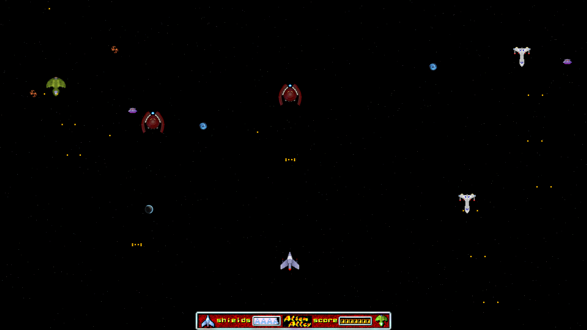

# AlienAlley

Source port & Mod of the Alien Alley demo game by Dave Roberts.

The Alien Alley demo game was written by Dave Roberts that came with the book PC Game Programming Explorer.
The book explains how to write games for MS-DOS. I bought the book a long time ago.
The game souce code was inlcude in a floppy disk that came with the book.
You can find the orginal game source code, binaries and assets here: http://www.droberts.com/pcgpex/pcgpex.htm

I must say, that it may have been this book that got me hooked to PC game coding.
Many years later while cleaning up my system, I found the orginal C source code for Alien Alley.
Since, I was tinkering with FreeBASIC at that time, I ported the C code to FreeBASIC/Allegro 4/Win32.
While doing so, I had to remove all the DOS low level stuff and re-write all of that to work with Allegro 4.
You can find my FreeBASIC source port here: https://github.com/a740g/AlienAlleyFB

Now, I am returning that source port to C/C++ using Allegro 5. Homecoming!
While doing so, I modifed the game to add more features, more alien, more effects, more sounds etc.
Major parts of the code was re-written with the help of Allegro Vivace by Doug Thompson.
You can find Allegro Vivace here: https://github.com/liballeg/allegro_wiki/wiki/Allegro-Vivace

If you want to compile the code, you will need Visual Studio 2019 Community Edition.
I do not accept responsibility for any effects, adverse or otherwise, that this code may have on you, your computer, your sanity, your dog, and anything else that you can think of. Use it at your own risk.
